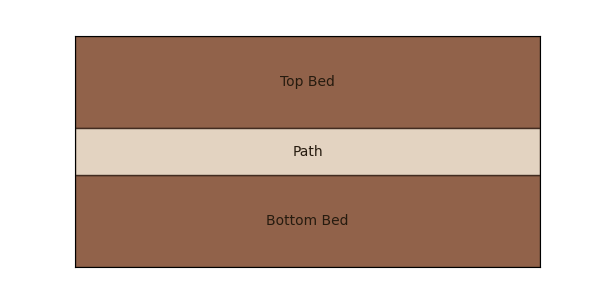
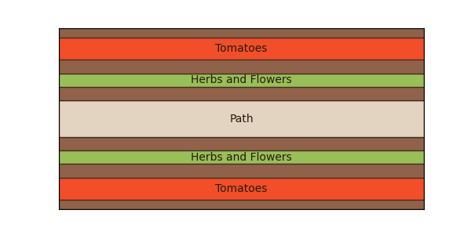

<!-- These are examples of badges you might want to add to your README:
     please update the URLs accordingly

[](https://cirrus-ci.com/github/<USER>/pygarden)
[](https://pygarden.readthedocs.io/en/stable/)
[](https://coveralls.io/r/<USER>/pygarden)
[](https://pypi.org/project/pygarden/)
[](https://anaconda.org/conda-forge/pygarden)
[](https://pepy.tech/project/pygarden)
[](https://twitter.com/pygarden)
-->

[](https://pyscaffold.org/)

# pygarden

> This is a small project to help me programatically draw out the plots at my community garden

This is a wrapper around `matplotlib` that defines a `Bed` class. It will make `Rectangle` objects that can have children and generate positions relative to each other.

# Examples
## Simple bed design
This is a simple bed design with two planting beds and a path down the middle.
```python
from pygarden import Bed

# units are arbitrary, but 10x20 feet is typical for my garden
full_plot = Bed(width=20, height=10)

# Make the first plantable bed, 4' wide
## "bed" is one of the pre-built colors, you can use any matplotlib color
## "width" (and height) property if unspecified will pull from the parent 
b1 = Bed(x=0, y=0, height=4, color="bed", label="Bottom Bed")

# Path, 2' wide, color of "path"
pth = Bed(
    x=0,
    y=b1.height, # Rather than calculate it myself, this makes it relative
    height=2,
    color="path",
    label="Path",
)

# Make top row
b2 = b1.copy() # Don't have to remake all properties. Deep copy.
b2.y = b1.height + pth.height # Put the y position relative
b2.label = "Top Bed"

# Add them to the plot and then make figure
full_plot.add_children([b1, b2, pth]) # Order here is unimportant
f, ax = full_plot.render()
```


## More complex design
```python
from pygarden import Bed
# This is the total plot
plot_tom_summer = Bed(width=20, height=10)
# Make the first bed
bottom_bed = Bed(
    x=0,
    y=0,
    height=4,
    color="bed",
)
# Path
path = Bed(
    x=0,
    y=bottom_bed.height,
    height=2,
    color="path",
    label="Path",
)

bottom_bed.add_children(
    [
        Bed(
            y=0.5,
            height=1.25,
            color="tomatoes",
            label="Tomatoes",
        ),
        Bed(y=2.5, height=0.75, color="veg", label="Herbs and Flowers"),
    ]
)

# Top bed is mirror of bottom
top_bed = bottom_bed.copy().mirror_vertically()
top_bed.y = bottom_bed.height + path.height
plot_tom_summer.add_children([bottom_bed, path, top_bed])


f, ax = plot_tom_summer.render()
```

